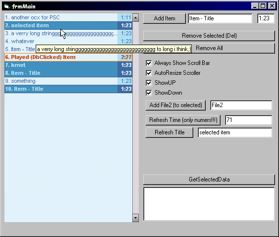



## A Winamp3 Style Playlist

### Description

This is Kind of a Playlist... Like in WinAmp3... it is ment to be used in media playing aplications...But I think it could be eqasily modified.... It has : *selcted option * played (DblClick) option * remove one * multi selcet * remove multi selct * clear list * change data for tile and time* shows lenght of the whole list * has an option to add a sevond file to entry (exp. i use it for subtitles path in my project) etc. Have fun, report me the bugs, rate it if u want it...
 
### More Info
 

             |
---                |---
**Submitted On**   |2003-09-18 06:10:02
**By**             |[3nity](https://github.com/Planet-Source-Code/PSCIndex/blob/master/ByAuthor/3nity.md)
**Level**          |Intermediate
**User Rating**    |4.8 (24 globes from 5 users)
**Compatibility**  |VB 6\.0
**Category**       |[Sound/MP3](https://github.com/Planet-Source-Code/PSCIndex/blob/master/ByCategory/sound-mp3__1-45.md)
**World**          |[Visual Basic](https://github.com/Planet-Source-Code/PSCIndex/blob/master/ByWorld/visual-basic.md)
**Archive File**   |[A\_Winamp3\_1646849182003\.zip](https://github.com/Planet-Source-Code/3nity-a-winamp3-style-playlist__1-48597/archive/master.zip)

